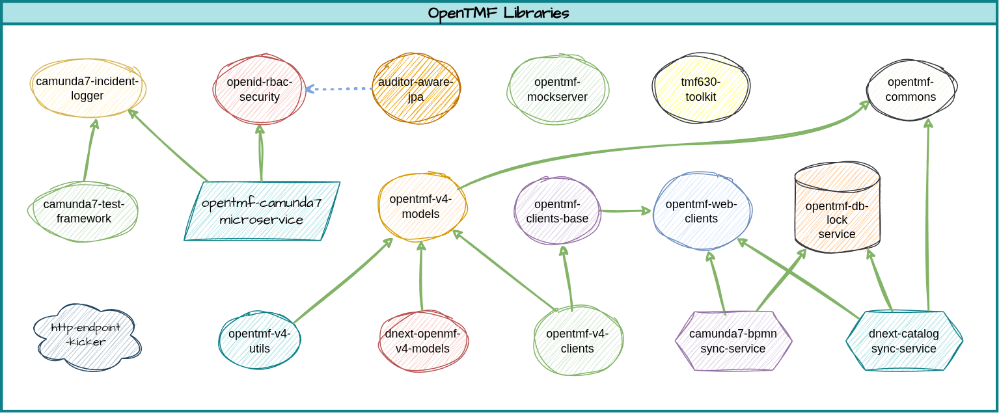

# opentmf-versions
A Super pom project that exposes the latest release versions of opentmf-commons artifacts.

The following image is a conceptual view of the artifacts whose compatible release versions are provided within this super pom project.



Note that many of those libraries are super pom projects themselves, providing several more artifacts. 

## Usage
In order to easily obtain the compatible versions of the latest released opentmf-commons libraries in your projects, import this super pom dependencies:

```xml
<dependencyManagement>
  <dependencies>
    <dependency>
      <groupId>org.opentmf</groupId>
      <artifactId>opentmf-versions</artifactId>
      <type>pom</type>
      <scope>import</scope>
      <version>RELEASE</version>
    </dependency>
  </dependencies>
</dependencyManagement>
```
**Heads Up**
> RELEASE is a reserved word for Maven. It means the latest released version of an artifact, excluding snapshots.
> 
> Despite providing the comfort of always using the latest released version of an artifact, the use of the RELEASE keyword is discouraged by Maven, because the build will produce a different result on subsequent builds when a new version of the dependent artifact is released.
> 
> Therefore, instead of using the keyword RELEASE, it is **_recommended_** to explicitly specify a version for tmf-commons-versions to achieve predictable builds even in the future.

And then you can depend on any OpenTMF project without specifying its version. For example:

```xml
<dependencies>
  <dependency>
    <groupId>org.opentmf.client</groupId>
    <artifactId>opentmf-openid-webclient-provider</artifactId>
  </dependency>
</dependencies>
```

## Links to the Artifacts

| groupId              | artifactId                                                                         | type | description                                                                                                                                                                                                                                                                     |
|----------------------|------------------------------------------------------------------------------------|------|---------------------------------------------------------------------------------------------------------------------------------------------------------------------------------------------------------------------------------------------------------------------------------|
| org.opentmf.commons  | opentmf-commons                                                                    | jar  | General purpose utility classes and annotations for any Java project.                                                                                                                                                                                                           |
| org.opentmf.model    | [opentmf-v4-models](https://github.com/opentmf/opentmf-v4-models)                  | pom  | Unified model classes generated for various TMF v4 specifications                                                                                                                                                                                                               |
| org.opentmf.util     | [opentmf-v4-utils](https://github.com/opentmf/opentmf-v4-utils)                    | pom  | Several utility classes for TMF v4 models.                                                                                                                                                                                                                                      |
| org.opentmf.dnext    | [dnext-tmf-v4-models](https://github.com/opentmf/dnext-opentmf-v4-models)          | pom  | DNext Model Extensions for TMF v4.                                                                                                                                                                                                                                              |
| org.opentmf.client   | [opentmf-web-clients](https://github.com/opentmf/opentmf-web-clients)              | pom  | General purpose WebClient libraries with cached getToken support                                                                                                                                                                                                                |
| org.opentmf.mockserver | [opentmf-mockserver](https://github.com/opentmf/opentmf-mockserver)                | jar  | An extended [mock-server](https://mock-server.com/) with cached requests emulating a TMF-630 compliant backend. Very useful for integration and functional tests.                                                                                                               |
| org.opentmf.client   | [opentmf-clients-base](https://github.com/opentmf/opentmf-clients-base)            | jar  | TMF Clients Base Classes and Common Implementation                                                                                                                                                                                                                              |
| org.opentmf.client   | [opentmf-v4-clients](https://github.com/opentmf/opentmf-v4-clients)                | pom  | TMF-630 compliant clients for several TMF v4 backends                                                                                                                                                                                                                           |
| org.opentmf.util     | [opentmf-db-lock-service](https://github.com/opentmf/opentmf-db-lock-service)      | jar  | Useful service to obtain cluster level persistent locks and memorize the latest lock versions.                                                                                                                                                                                  |
| org.opentmf.camunda  | [camunda7-bpmn-sync-service](https://github.com/opentmf/camunda7-bpmn-sync-service) | jar  | Synchronizes the BPMNs to Camunda 7 on app startup and if requested, performs process instance migration                                                                                                                                                                        |
| org.opentmf.dnext    | [dnext-catalog-sync-service](https://github.com/opentmf/dnext-catalog-sync-service) | jar  | Syncronizes versioned resource, service and product catalogs with the DNext catalog backends on app startup.                                                                                                                                                                    |
| org.opentmf.camunda  | [camunda7-incident-logger](https://github.com/opentmf/camunda7-incident-logger)    | jar  | Writes easy-to-track log statements when an incident occurs in Camunda7                                                                                                                                                                                                         |
| org.opentmf.camunda  | [camunda7-test-framework](https://github.com/opentmf/camunda7-test-framework)      | jar  | Writes easy-to-track log statements when an incident occurs in Camunda 7                                                                                                                                                                                                        |
| org.opentmf.security | [openid-rbac-security](https://github.com/opentmf/openid-rbac-security)            | jar  | OpenID Role based Access Control (RBAC) Security Library                                                                                                                                                                                                                        |
| org.opentmf.util     | [auditor-aware-jpa](https://github.com/opentmf/auditor-aware-jpa)                  | jar  | Auditor aware base JPA mapped super classes for either servlet or reactive web applications                                                                                                                                                                                     |
| org.opentmf.camunda  | [opentmf-camunda7](https://github.com/opentmf/opentmf-camunda7)                    | jar  | An OpenTMF produced Spring Boot microservice that embeds the latest Camunda7 community edition with the public Spin, and OpenID auth for Keycloak plugins, as well as using OpenTMF's Camunda7 Incident Logger, and openid-rbac-security framework to secure the API endpoints. |


## Release Notes
### 1.0.0 - 1.0.4
- Initial Releases
### 1.0.5
- Updated pia-security to 1.0.3
- Updated pia-camunda-7 to 22.0.2 (to use pia-security 1.0.3)
### 1.0.6
- Updated pia-web-clients to 1.0.5
- Updated pia-db-lock-service to 1.0.3
- Updated pia-bpmn-sync-service to 1.0.3
- Updated pia-catalog-sync-service to 1.0.2
- Updated pia-web-clients to 1.0.5
- Updated tmf-clients-base to 1.0.2
- Updated tmf-v4-clients to 1.0.4
### 1.0.7
- Updated dnext-tmf-v4-models versions
### 1.0.8
- pia-security: 1.0.3 -> 1.0.5
- pia-db-lock-service: 1.0.4 -> 1.0.5
- pia-bpmn-sync-service: 1.0.4 -> 1.0.5
- pia-catalog-sync-service: 1.0.3 -> 1.0.4
### 1.0.9
- adds tmf-681 v4 model and tmf-client 
- dependency updates of dnext tmf v4 models and tmf v4 utils
### 1.1.0
- updates many library versions to their latest
- includes the fix in quoteClientProvider bean name
### 1.1.1
- introduces auditor-aware-jpa
- updates pia-security to 1.0.7
- updated pia-camunda-7 to 22.0.6 
- adds dnext-tmf-633-model to dnext-tmf-v4-models
### 1.1.2
- Updated dynamic-mock-expectations to 1.0.1
- Updated pia-db-lock-service to 1.0.7
- Updated pia-bpmn-sync-service to 1.0.7
- Updated pia-catalog-sync-service to 1.0.6
### 1.1.3
- Updated pia-bpmn-sync-service to 1.0.8
### 1.1.4
- Updates to pia-web-clients 1.0.8, for fewer dependencies for the reactive WebClient.
- The affected projects from the pia-web-clients update are also updated:
  - pia-bpmn-sync-service
  - pia-catalog-sync-service
  - pia-web-clients
  - tmf-clients-base
  - tmf-v4-clients
- Corrected the link from the tmf-clients-base to the pia-web-clients in pia-libraries.png
### 1.1.5
- Updated pia-security to 1.0.8
### 1.1.6
- Updated pia-bpmn-sync-service to 1.1.0
- Updated pia-catalog-sync-service to 1.0.8
### 1.1.7
- Updated pia-commons to 1.0.1
- Updated dnext-tmf-v4-models to 1.0.6
### 1.1.8
- Updated pia-security to 1.0.9
### 1.1.9
- Updated auditor-aware-jpa to 1.0.2
- Updated pia-commons to 1.0.2
### 1.2.0
- Updated dnext-tmf-v4-models to 1.0.7
### 1.2.1
- Updated dnext-tmf-v4-models to 1.0.8
### 1.2.2
- Updated tmf-v4-utils to 1.0.4, that adds validateOrder method to ServiceOrderUtil.
### 1.2.3
- Updated pia-web-clients to 1.0.9, which adds the ability to use mutual TLS authentication.
### 1.2.4
- Updated camunda-7-test-framework to 1.0.3, which adds the ability to use set listeners for each and every task, not only receive tasks.
### 1.2.5
- Updated dnext-tmf-v4-models to 1.0.9, which adds DNextProductOffering with the extended field "rules".
### 1.2.6
- Updated tmf-clients-base to 1.0.5
- Updated tmf-v4-clients to 1.1.0
### 1.2.7 (Backward Incompatible)
- Updated tmf-clients-base to 1.1.0
- Updated tmf-v4-clients to 1.1.1
### 1.3.0
- Initial open-source version, replacing pia with opentmf
### 1.3.1
- Updates dnext-catalog-sync-service to 1.1.0
### 1.3.2
- Updates opentmf-commons version to 1.0.6 (numeric values allowed in OffsetDateTime deserialization)
- Updates opentmf-clients-base version to 1.1.2 (better error handling for non-json content or no content)
