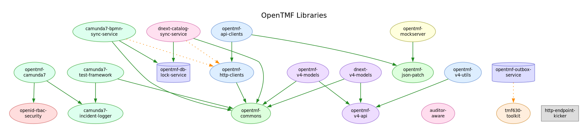
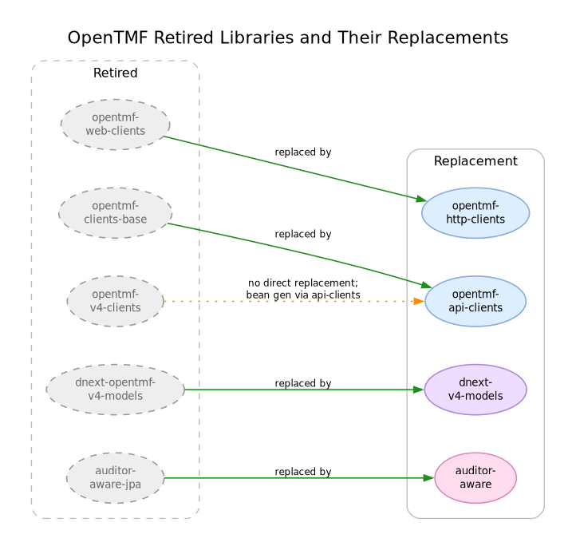

# opentmf-versions

A Maven BOM (Bill of Materials) that provides compatible release versions for all OpenTMF artifacts.

See [CHANGELOG.md](CHANGELOG.md) for release notes.

## Version Compatibility

| BOM version | Spring Boot | Jackson | Status |
|---|---|---|---|
| **2.x** | 4.x | 3.x | Active development |
| **1.x** | 3.5.x | 2.x | Maintenance only |

## Overview

The diagram below shows the OpenTMF libraries and their compile-time dependencies. Many of these are multi-module projects that provide several additional artifacts.



## Usage

Pin the BOM version in your `<properties>` and import it under `<dependencyManagement>`:

```xml
<properties>
  <opentmf-versions.version>2.1.16</opentmf-versions.version>
</properties>

<dependencyManagement>
  <dependencies>
    <dependency>
      <groupId>org.opentmf</groupId>
      <artifactId>opentmf-versions</artifactId>
      <type>pom</type>
      <scope>import</scope>
      <version>${opentmf-versions.version}</version>
    </dependency>
  </dependencies>
</dependencyManagement>
```

Then depend on any OpenTMF artifact without specifying its version:

```xml
<dependencies>
  <dependency>
    <groupId>org.opentmf.client</groupId>
    <artifactId>opentmf-http-clients-starter</artifactId>
  </dependency>
</dependencies>
```

## Artifacts

> The **Current** column below is auto-populated from `pom.xml` properties at build time via `maven-resources-plugin`. Do not edit this table directly — edit `src/main/templates/README.md` and run `mvn generate-resources`.

| groupId                | artifactId                                                                          | type   | description                                                                                                               | Since   | Current |
|------------------------|-------------------------------------------------------------------------------------|--------|---------------------------------------------------------------------------------------------------------------------------|---------|---------|
| org.opentmf.commons    | [opentmf-commons](https://github.com/opentmf/opentmf-commons)                       | jar    | Shared utilities, annotations, and base classes used across all OpenTMF projects.                                         | 1.0.4   | 2.2.0   |
| org.opentmf.commons    | [opentmf-json-patch](https://github.com/opentmf/opentmf-json-patch)                 | jar    | JSON Patch (RFC 6902) implementation for partial resource updates.                                                        | 1.0.0   | 1.1.0   |
| org.opentmf.errors     | [opentmf-errors](https://github.com/opentmf/opentmf-errors)                         | pom    | Shared error-code catalog and Spring `ProblemDetail` / TMF-style error renderers.                                         | 1.0.0   | 1.0.0   |
| org.opentmf.model      | [opentmf-v4-models](https://github.com/opentmf/opentmf-v4-models)                   | pom    | Generated Java model classes for 80+ TMF v4 API specifications.                                                           | 1.0.4   | 4.1.1   |
| org.opentmf.model      | [opentmf-v4-api](https://github.com/opentmf/opentmf-v4-api)                         | pom    | Generated Spring controller interfaces for 80+ TMF v4 API specifications.                                                 | 4.0.5   | 4.1.1   |
| org.opentmf.util       | [opentmf-v4-utils](https://github.com/opentmf/opentmf-v4-utils)                     | pom    | Convenience utilities for working with TMF v4 model objects.                                                              | 1.0.5   | 2.0.0   |
| org.opentmf.model      | [dnext-v4-models](https://github.com/opentmf/dnext-v4-models)                       | pom    | Extended model classes covering all available DNext TMF implementations and their custom extensions.                      | 2.11.2  | 2.12.1  |
| org.opentmf.client     | [opentmf-http-clients](https://github.com/opentmf/opentmf-http-clients)             | pom    | HTTP client foundation for REST and Reactive clients with unified configuration and cached bearer-token and mTLS support. | 2.0.0   | 2.1.6   |
| org.opentmf.client     | [opentmf-api-clients](https://github.com/opentmf/opentmf-api-clients)               | pom    | Ready-to-use TMF-630 compliant API clients for TMF v4 backends (REST and reactive).                                       | 2.0.0   | 2.0.9   |
| org.opentmf.query      | [tmf630-toolkit](https://github.com/opentmf/tmf630-toolkit)                         | pom    | TMF-630 compliant filtering, paging, and sorting for Spring Web MVC and MongoDB.                                          | 1.0.0   | 3.0.1   |
| org.opentmf.mockserver | [opentmf-mockserver](https://github.com/opentmf/opentmf-mockserver-parent)          | jar    | [MockServer](https://mock-server.com/)-based test double that emulates a TMF-630 compliant backend.                       | 1.0.2   | 2.1.11  |
| org.opentmf.security   | [openid-rbac-security](https://github.com/opentmf/openid-rbac-security)             | jar    | OpenID Connect authentication with role-based access control (RBAC) for Spring Boot.                                      | 1.1.0   | 2.3.0   |
| org.opentmf.util       | [auditor-aware](https://github.com/opentmf/auditor-aware)                           | jar    | Persistence-agnostic `AuditorAware<String>` and `DateTimeProvider` beans for tracking created/modified-by audit fields.   | 3.0.0   | 3.0.0   |
| org.opentmf.util       | [opentmf-db-lock-service](https://github.com/opentmf/opentmf-db-lock-service)       | jar    | Database-backed distributed lock service for cluster-level coordination.                                                  | 1.0.8   | 2.2.1   |
| org.opentmf.camunda    | [camunda7-incident-logger](https://github.com/opentmf/camunda7-incident-logger)     | jar    | Produces structured, easy-to-trace log entries when a Camunda 7 incident occurs.                                          | 1.0.3   | 2.0.1   |
| org.opentmf.camunda    | [camunda7-test-framework](https://github.com/opentmf/camunda7-test-framework)       | jar    | Test harness for verifying Camunda 7 process definitions and task flows.                                                  | 1.0.4   | 2.0.2   |
| org.opentmf.camunda    | [camunda7-bpmn-sync-service](https://github.com/opentmf/camunda7-bpmn-sync-service) | jar    | Deploys BPMN definitions to Camunda 7 on startup with optional process instance migration.                                | 1.1.1   | 2.1.1   |
| org.opentmf.dnext      | [dnext-catalog-sync-service](https://github.com/opentmf/dnext-catalog-sync-service) | jar    | Keeps versioned resource, service, and product catalogs in sync with DNext catalog backends.                              | 1.0.9   | 2.0.4   |
| org.opentmf.camunda    | [opentmf-camunda7](https://github.com/opentmf/opentmf-camunda7)                     | jar    | Spring Boot microservice embedding Camunda 7 Community Edition with OpenID SSO and RBAC.                                  | 23.0.0  | 24.0.6  |
| N/A                    | [http-endpoint-kicker](https://github.com/opentmf/http-endpoint-kicker)             | docker | Minimal Docker sidecar that optionally obtains an access token, fires a single HTTP request, and exits.                   | 1.0.0   | 1.0.0   |

## Retired Artifacts

The diagram below shows the libraries that have been retired and what replaced them.



| groupId            | artifactId              | type | description                                                                                                             | Since  | Replaced by                               |
|--------------------|-------------------------|------|-------------------------------------------------------------------------------------------------------------------------|--------|-------------------------------------------|
| org.opentmf.client | opentmf-web-clients     | pom  | WebClient-based HTTP client library with Logbook integration, fixed-headers support, and cached bearer-token retrieval. | 1.1.0  | opentmf-http-clients                      |
| org.opentmf.client | opentmf-clients-base    | jar  | Base classes and implementation logic for communicating with TMF-630–compliant backends (Spring Boot 3 only).           | 1.1.1  | opentmf-api-clients                       |
| org.opentmf.client | opentmf-v4-clients      | pom  | Generated TMF-630 compliant client providers for TMF v4 backends.                                                       | 1.1.2  | opentmf-api-clients (via bean generation) |
| org.opentmf.dnext  | dnext-opentmf-v4-models | pom  | Hand-written DNext-extended TMF v4 model classes covering a subset of DNext microservices.                              | 1.1.0  | dnext-v4-models                           |
| org.opentmf.util   | auditor-aware-jpa       | jar  | JPA mapped superclasses that automatically track created/modified-by audit fields.                                      | 1.0.3  | auditor-aware                             |
