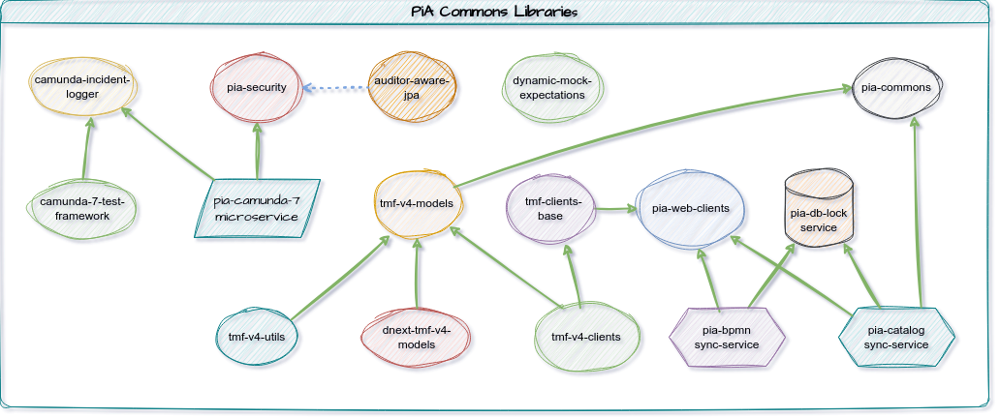

# pia-commons-versions
A Super pom project that exposes the latest release versions of pia-commons artifacts.

The following image is a conceptual view of the artifacts whose compatible release versions are provided within this super pom project.



Note that many of those libraries are super pom projects themselves, providing several more artifacts. 

## Usage
In order to easily obtain the compatible versions of the latest released pia-commons libraries in your projects, import this super pom dependencies:

```xml
<dependencyManagement>
  <dependencies>
    <dependency>
      <groupId>com.pia.commons</groupId>
      <artifactId>pia-commons-versions</artifactId>
      <type>pom</type>
      <scope>import</scope>
      <version>RELEASE</version>
    </dependency>
  </dependencies>
</dependencyManagement>
```
**Heads Up**
> RELEASE is a reserved word for Maven. It means the latest released version of an artifact, excluding snapshots.
> 
> Despite providing the comfort of always using the latest released version of an artifact, the use of the RELEASE keyword is discouraged by Maven, because the build will produce a different result on subsequent builds when a new version of the dependent artifact is released.
> 
> Therefore, instead of using the keyword RELEASE, it is **_recommended_** to explicitly specify a version for tmf-commons-versions to achieve predictable builds even in the future.

And then you can depend on any com.pia.commons project without specifying a version. For example:

```xml
<dependencies>
  <dependency>
    <groupId>com.pia.commons</groupId>
    <artifactId>pia-openid-webclient-provider</artifactId>
  </dependency>
</dependencies>
```
## Release Notes
### 1.0.0 - 1.0.4
- Initial Releases
### 1.0.5
- Updated pia-security to 1.0.3
- Updated pia-camunda-7 to 22.0.2 (to use pia-security 1.0.3)
### 1.0.6
- Updated pia-web-clients to 1.0.5
- Updated pia-db-lock-service to 1.0.3
- Updated pia-bpmn-sync-service to 1.0.3
- Updated pia-catalog-sync-service to 1.0.2
- Updated pia-web-clients to 1.0.5
- Updated tmf-clients-base to 1.0.2
- Updated tmf-v4-clients to 1.0.4
### 1.0.7
- Updated dnext-tmf-v4-models versions
### 1.0.8
- pia-security: 1.0.3 -> 1.0.5
- pia-db-lock-service: 1.0.4 -> 1.0.5
- pia-bpmn-sync-service: 1.0.4 -> 1.0.5
- pia-catalog-sync-service: 1.0.3 -> 1.0.4
### 1.0.9
- adds tmf-681 v4 model and tmf-client 
- dependency updates of dnext tmf v4 models and tmf v4 utils
### 1.1.0
- updates many library versions to their latest
- includes the fix in quoteClientProvider bean name
### 1.1.1
- introduces auditor-aware-jpa
- updates pia-security to 1.0.7
- updated pia-camunda-7 to 22.0.6 
- adds dnext-tmf-633-model to dnext-tmf-v4-models
### 1.1.2
- Updated dynamic-mock-expectations to 1.0.1
- Updated pia-db-lock-service to 1.0.7
- Updated pia-bpmn-sync-service to 1.0.7
- Updated pia-catalog-sync-service to 1.0.6
### 1.1.3
- Updated pia-bpmn-sync-service to 1.0.8
### 1.1.4
- Updates to pia-web-clients 1.0.8, for fewer dependencies for the reactive WebClient.
- The affected projects from the pia-web-clients update are also updated:
  - pia-bpmn-sync-service
  - pia-catalog-sync-service
  - pia-web-clients
  - tmf-clients-base
  - tmf-v4-clients
- Corrected the link from the tmf-clients-base to the pia-web-clients in pia-libraries.png
### 1.1.5
- Updated pia-security to 1.0.8
### 1.1.6
- Updated pia-bpmn-sync-service to 1.1.0
- Updated pia-catalog-sync-service to 1.0.8
